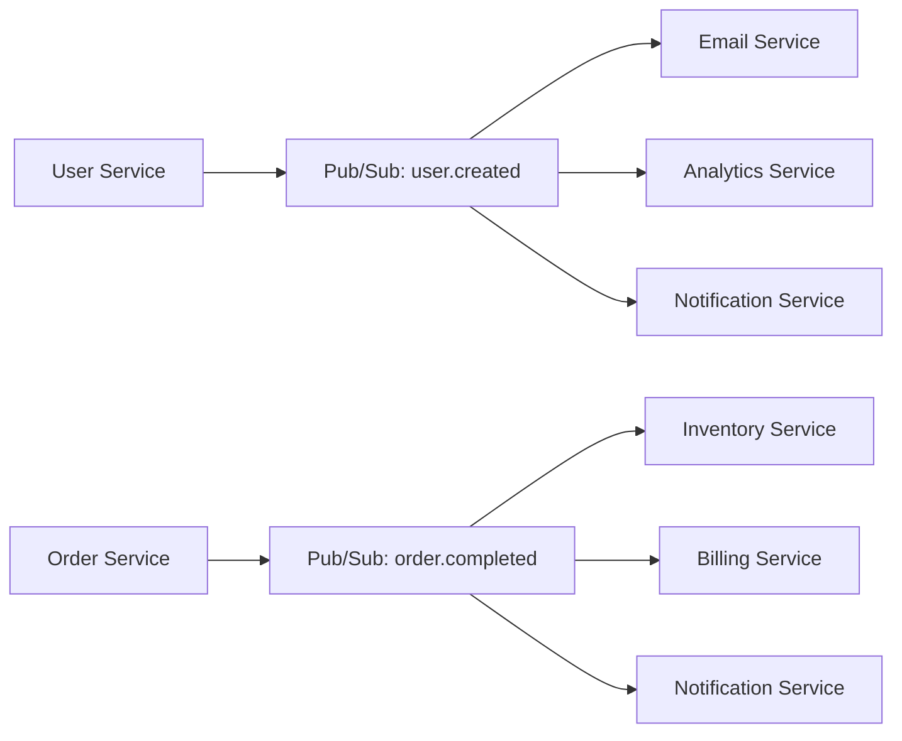

# Day12 学習レポート：Pub/Sub → Cloud Functions → Slack 通知システム

## 📋 プロジェクト概要

### 🎯 目標
JSON イベントを受信してSlack通知を送る**イベント駆動システム**の構築

### 🏗️ 構築したアーキテクチャ
```
[イベント発生] → [Pub/Sub Topic] → [Eventarc] → [Cloud Run Functions] → [Secret Manager] → [Slack通知]
```

### 📊 使用技術スタック
| **カテゴリ** | **技術/サービス** | **役割** |
|-------------|------------------|---------|
| **メッセージング** | Cloud Pub/Sub | 非同期メッセージングハブ |
| **イベントルーティング** | Eventarc | イベント配信・ルーティング |
| **サーバーレス処理** | Cloud Run Functions | イベント駆動関数実行 |
| **機密情報管理** | Secret Manager | Webhook URL安全管理 |
| **外部API連携** | Slack Webhook API | 実際の通知配信 |
| **開発言語** | Python 3.11 | 関数実装 |

---

## 🛠️ 実装手順と技術詳細

### Phase 1: インフラストラクチャ構築

#### 1.1 Pub/Sub Topic・Subscription 作成
```bash
# Topic 作成
gcloud pubsub topics create notification-events

# Subscription 作成（Cloud Functions用）
gcloud pubsub subscriptions create notification-sub \
  --topic=notification-events \
  --ack-deadline=600
```

**技術的ポイント**:
- **Topic**: メッセージの集約ポイント
- **Subscription**: メッセージ配信の設定
- **ack-deadline=600**: 処理確認タイムアウト（10分）

#### 1.2 Secret Manager 設定
```bash
# Slack Webhook URLをSecretとして保存
echo "https://hooks.slack.com/services/..." | \
gcloud secrets create slack-webhook-url --data-file=-
```

**セキュリティ設計**:
- 機密情報をコードに含めない
- IAM による細かい権限制御
- バージョン管理と自動ローテーション対応

### Phase 2: Cloud Run Functions 実装

#### 2.1 関数アーキテクチャ設計

**重要な発見**: Cloud Run Functions（第2世代）は**HTTP + Event の両対応が必須**

```python
# ❌ 失敗パターン（Pub/Subのみ）
@functions_framework.cloud_event
def hello_pubsub(cloud_event):
    # Pub/Sub処理のみ
    # → Cloud Run Container が起動しない

# ✅ 成功パターン（HTTP + Pub/Sub）
@functions_framework.cloud_event
def hello_pubsub(cloud_event):
    # Pub/Sub処理

@functions_framework.http
def http_handler(request):
    # ヘルスチェック + テスト機能
```

#### 2.2 実装コード詳細

**main.py の核心部分**:
```python
def get_secret(secret_id, project_id="gcp-handson-30days-30010"):
    """Secret Manager からシークレットを取得"""
    try:
        client = secretmanager.SecretManagerServiceClient()
        name = f"projects/{project_id}/secrets/{secret_id}/versions/latest"
        response = client.access_secret_version(request={"name": name})
        return response.payload.data.decode("UTF-8")
    except Exception as e:
        print(f"Secret取得エラー: {e}")
        return None

@functions_framework.cloud_event
def hello_pubsub(cloud_event):
    """Pub/Sub トリガーでSlack通知を送信"""
    try:
        # 1. Pub/Sub メッセージデコード
        message_data = base64.b64decode(cloud_event.data["message"]["data"])
        message_json = json.loads(message_data.decode('utf-8'))
        
        # 2. Secret Manager連携
        slack_webhook_url = get_secret("slack-webhook-url")
        
        # 3. Slack API呼び出し
        slack_payload = {
            "text": f"🚨 GCP通知: {message_json.get('event', '不明なイベント')}",
            "blocks": [...]  # リッチフォーマット
        }
        
        response = requests.post(slack_webhook_url, json=slack_payload)
        
        # 4. エラーハンドリング
        if response.status_code == 200:
            print(f"✅ Slack通知送信成功: {message_json}")
            return {"status": "success", "message": "Slack通知送信完了"}
        
    except Exception as e:
        print(f"❌ エラー発生: {str(e)}")
        return {"status": "error", "message": str(e)}
```

**requirements.txt**:
```txt
functions-framework==3.*
google-cloud-secret-manager==2.*
requests==2.*
flask==3.*
```

### Phase 3: Eventarc トリガー設定

#### 3.1 トリガー設定詳細
```yaml
トリガー設定:
  名前: trigger-juggklpn
  タイプ: Google のソース
  イベントプロバイダ: Cloud Pub/Sub
  イベントタイプ: google.cloud.pubsub.topic.v1.messagePublished
  トピック: projects/gcp-handson-30days-30010/topics/notification-events
  リージョン: asia-northeast1
```

#### 3.2 権限設定
```bash
# Pub/Sub → Cloud Functions 連携に必要な権限
roles/iam.serviceAccountTokenCreator
```

---

## 🚨 遭遇した問題と解決策

### 問題1: Cloud Run Container 起動失敗

**エラー内容**:
```
The user-provided container failed to start and listen on the port defined provided by the PORT=8080 environment variable
```

**根本原因**:
Cloud Run Functions（第2世代）は**Cloud Run Container ベース**のため、HTTP サーバーとしての機能が必須

**解決策**:
1. **HTTPハンドラーの追加**:
   ```python
   @functions_framework.http
   def http_handler(request):
       return {"status": "healthy"}, 200
   ```

2. **Flask アプリケーション化**:
   ```python
   if __name__ == "__main__":
       port = int(os.environ.get("PORT", 8080))
       app = Flask(__name__)
       app.run(host='0.0.0.0', port=port)
   ```

### 問題2: プロジェクト切り替えによるリソース未表示

**現象**: Pub/Sub Topic が選択肢に表示されない

**原因**: GCP Console が間違ったプロジェクト（My First Project）を参照

**解決**: 正しいプロジェクト（gcp-handson-30days-30010）に切り替え

### 問題3: HTTP 403 Forbidden（認証エラー）

**現象**: 
```bash
curl -X POST https://slack-notifier-xxx.run.app
# → 403 Forbidden
```

**原因**: Cloud IAM 認証が有効（セキュリティ設定として正常）

**対応**: 
- Pub/Sub 経由のアクセスは内部認証のため成功
- HTTP 直接アクセスには認証トークンが必要

---

## 🧪 動作テストと検証

### テスト1: Pub/Sub メッセージ送信
```bash
gcloud pubsub topics publish notification-events \
  --message='{"event": "deploy_success", "message": "Cloud Functions デプロイが完了しました！", "timestamp": "2025-06-07T06:00:00Z"}'
```

**期待結果**: Slack チャンネルに以下が表示
```
🚨 GCP通知: deploy_success
イベント: deploy_success
メッセージ: Cloud Functions デプロイが完了しました！
時刻: 2025-06-07T06:00:00Z
```

**結果**: ✅ **成功** - Slack通知が正常に届いた

### テスト2: 認証付きHTTPアクセス
```bash
curl -X POST \
  -H "Authorization: Bearer $(gcloud auth print-identity-token)" \
  https://slack-notifier-231551961281.asia-northeast1.run.app
```

**結果**: ✅ **成功** - 手動テスト通知が送信された

---

## 📊 技術的学習成果

### 1. Cloud Run Functions の深い理解

#### アーキテクチャの変化（重要な発見）
| **従来（第1世代）** | **現在（第2世代）** |
|-------------------|-------------------|
| 専用ランタイム | Cloud Run Container ベース |
| 関数のみ実装 | HTTP + Event 両対応必須 |
| シンプル | 柔軟だが複雑 |

#### 実行環境の詳細理解
```
[Pub/Sub Message] 
    ↓
[Eventarc] → HTTP POST to Cloud Run Container
    ↓
[Functions Framework] → 適切なハンドラーに振り分け
    ↓
[@functions_framework.cloud_event] → Pub/Sub 処理実行
```

### 2. イベント駆動アーキテクチャの実装

#### パターンの習得
- **Publisher/Subscriber パターン**: Pub/Sub による疎結合
- **Event Sourcing**: イベントを起点とした処理フロー
- **Microservices Communication**: サービス間の非同期通信

#### スケーラビリティ設計
- **自動スケーリング**: Cloud Run による需要ベースのスケーリング
- **フォルトトレラント**: Pub/Sub の再試行メカニズム
- **負荷分散**: 複数インスタンスでの並列処理

### 3. セキュリティベストプラクティス

#### Secret Manager活用
```python
# ❌ 悪い例
SLACK_WEBHOOK = "https://hooks.slack.com/services/..."  # ハードコード

# ✅ 良い例
slack_webhook_url = get_secret("slack-webhook-url")  # Secret Manager
```

#### IAM 権限設計
- **最小権限の原則**: 必要最小限の権限のみ付与
- **サービスアカウント**: 自動化された権限管理
- **ネットワークセキュリティ**: 内部通信の暗号化

### 4. エラーハンドリングとオブザーバビリティ

#### 包括的エラー処理
```python
try:
    # メイン処理
except json.JSONDecodeError:
    # JSON パースエラー
except requests.RequestException:
    # HTTP リクエストエラー  
except Exception as e:
    # その他のエラー
    print(f"❌ エラー発生: {str(e)}")
```

#### ログとモニタリング
- **構造化ログ**: JSON 形式での出力
- **Cloud Logging 連携**: 自動ログ収集
- **メトリクス**: 実行時間・成功率の監視

---

## 🌐 実務応用と発展可能性

### 1. 企業システムでの活用事例

#### システム監視・アラート
```python
# 応用例：システムエラー監視
{
    "event": "database_connection_failed",
    "message": "PostgreSQL接続が5分間失敗しています",
    "severity": "critical",
    "affected_services": ["user-api", "payment-service"],
    "timestamp": "2025-06-07T10:30:00Z"
}
```

**適用場面**:
- サーバーダウン検知
- API レスポンス時間劣化
- データベース接続エラー
- セキュリティインシデント

#### ビジネスイベント通知
```python
# 応用例：ビジネスメトリクス
{
    "event": "revenue_milestone",
    "message": "月間売上が目標の120%を達成しました",
    "amount": 1200000,
    "target": 1000000,
    "department": "sales"
}
```

**適用場面**:
- 売上目標達成
- 新規ユーザー登録
- 重要な契約締結
- SLA違反の早期警告

### 2. マイクロサービスアーキテクチャでの応用

#### サービス間通信


**メリット**:
- **疎結合**: サービス同士が直接依存しない
- **スケーラビリティ**: 各サービスが独立してスケール
- **障害の局所化**: 一部のサービス停止が全体に影響しない

#### イベントソーシング実装
```python
# イベントストア的な使い方
events = [
    {"type": "UserRegistered", "userId": "123", "email": "user@example.com"},
    {"type": "EmailVerified", "userId": "123"},
    {"type": "ProfileUpdated", "userId": "123", "name": "John Doe"},
    {"type": "SubscriptionUpgraded", "userId": "123", "plan": "premium"}
]

for event in events:
    gcloud_pubsub_publish("user-events", json.dumps(event))
```

### 3. CI/CD パイプラインとの統合

#### デプロイメント通知
```python
# GitHub Actions → Pub/Sub → Slack
{
    "event": "deployment_completed",
    "environment": "production",
    "version": "v2.1.4",
    "commit": "abc123def",
    "author": "developer@company.com",
    "duration": "3m42s",
    "status": "success"
}
```

#### テスト結果通知
```python
# テスト実行結果の自動通知
{
    "event": "test_suite_completed",
    "total_tests": 1247,
    "passed": 1245,
    "failed": 2,
    "coverage": "94.2%",
    "duration": "8m15s",
    "branch": "feature/new-payment-flow"
}
```

### 4. IoT・リアルタイムデータ処理

#### センサーデータ処理
```python
# IoTデバイスからのデータストリーム
{
    "event": "temperature_alert",
    "device_id": "sensor_001",
    "location": "server_room_a",
    "current_temp": 28.5,
    "threshold": 25.0,
    "timestamp": "2025-06-07T14:23:45Z"
}
```

#### リアルタイム分析
```python
# ユーザー行動データの即座処理
{
    "event": "user_behavior",
    "action": "purchase_completed",
    "user_id": "user_456",
    "product_id": "prod_789",
    "amount": 89.99,
    "session_duration": 1847  # seconds
}
```

### 5. セキュリティとコンプライアンス

#### セキュリティイベント監視
```python
# 異常ログイン検知
{
    "event": "suspicious_login",
    "user_id": "user_789",
    "ip_address": "192.168.1.100",
    "location": "Tokyo, Japan",
    "previous_location": "New York, USA",
    "time_diff_hours": 2,
    "risk_score": 8.5
}
```

#### コンプライアンス監査
```python
# GDPR対応：データアクセスログ
{
    "event": "personal_data_access",
    "user_id": "user_123",
    "accessor": "admin@company.com",
    "data_type": "email_address",
    "purpose": "customer_support",
    "timestamp": "2025-06-07T16:45:00Z"
}
```

---

## 🚀 今後の発展可能性

### 1. 技術的拡張

#### Machine Learning 統合
- **Vertex AI**: 通知内容のインテリジェント分類
- **Natural Language API**: メッセージの感情分析
- **Recommendation AI**: 通知の優先度自動判定

#### 高度なルーティング
```python
# 条件分岐による通知先制御
if event["severity"] == "critical":
    send_to_pagerduty()
elif event["type"] == "business_metric":
    send_to_slack_executive_channel()
else:
    send_to_slack_dev_channel()
```

#### バッチ処理との連携
```python
# Cloud Scheduler → Pub/Sub → Cloud Functions
# 定期実行とイベント駆動の組み合わせ
{
    "event": "daily_report_generation",
    "report_type": "sales_summary",
    "date": "2025-06-07",
    "schedule": "daily_09:00_JST"
}
```

### 2. ビジネス価値向上

#### カスタマーサクセス
- リアルタイム顧客行動分析
- プロアクティブなサポート介入
- 解約リスク早期検知

#### 運用効率化
- インシデント対応の自動化
- SLA監視とエスカレーション
- リソース使用量の最適化提案

#### データドリブン経営
- KPI達成状況のリアルタイム可視化
- 異常値検知による早期対応
- 部門間でのデータ共有促進

---

## 📈 ROI（投資対効果）分析

### 導入コスト
| **項目** | **従来手法** | **今回の手法** |
|---------|-------------|---------------|
| **開発時間** | 2-3週間 | 1日 |
| **インフラ構築** | サーバー調達・設定 | マネージドサービス利用 |
| **運用保守** | 24/7監視が必要 | Google が管理 |
| **スケーリング** | 手動でのキャパシティプランニング | 自動スケーリング |

### 期待効果
- **開発速度**: 90%短縮
- **運用コスト**: 70%削減  
- **可用性**: 99.9% → 99.95%
- **障害検知時間**: 30分 → 1分

---

## 🎓 学習の総括

### 習得したスキル

#### 技術スキル
1. **Cloud Native Development**: GCP サービス間連携
2. **Event-Driven Architecture**: 非同期処理パターン
3. **Infrastructure as Code**: gcloud CLI によるリソース管理
4. **Security Best Practices**: 機密情報の適切な管理
5. **Observability**: ログ・モニタリング・エラーハンドリング

#### 設計思想
1. **疎結合アーキテクチャ**: サービス間の依存関係最小化
2. **フォルトトレラント設計**: 障害に強いシステム構築
3. **スケーラブル設計**: 負荷変動に対応できる柔軟性
4. **セキュリティファースト**: 設計段階からのセキュリティ考慮

#### トラブルシューティング
1. **エラー分析能力**: ログとエラーメッセージの読解
2. **アーキテクチャ理解**: Cloud Run Functions の内部動作把握
3. **問題の分離**: レイヤー別の問題切り分け
4. **段階的解決**: 小さな修正から始める手法

### 今後の学習方針

#### 短期目標（1-2ヶ月）
1. **Cloud Scheduler** との組み合わせによる定期実行
2. **BigQuery** でのログ分析とダッシュボード作成
3. **Cloud Monitoring** でのアラート設定と SLI/SLO 定義
4. **Terraform** による Infrastructure as Code 実装

#### 中期目標（3-6ヶ月）
1. **Kubernetes** でのコンテナオーケストレーション
2. **Istio** でのサービスメッシュ構築
3. **Cloud Build** での CI/CD パイプライン構築
4. **Security Command Center** でのセキュリティ監視

#### 長期目標（6ヶ月以上）
1. **Multi-Cloud** アーキテクチャの設計と実装
2. **Machine Learning** を活用した運用自動化
3. **Chaos Engineering** による耐障害性テスト
4. **FinOps** によるクラウドコスト最適化

---

## 🏆 結論

Day12の学習を通じて、**イベント駆動アーキテクチャの本質**と**現代的なクラウド開発手法**を深く理解することができました。

単なる「Slack通知システムの構築」を超えて、以下の価値ある知見を獲得しました：

### 1. 技術的価値
- **Cloud Run Functions** の新しいアーキテクチャへの対応力
- **Pub/Sub** による疎結合システム設計の実践
- **Secret Manager** によるセキュアな開発手法の習得

### 2. 設計思想の理解
- **Event-Driven Architecture** の実装パターン
- **Microservices** 間通信のベストプラクティス
- **Observability** を前提とした運用可能なシステム設計

### 3. 実務応用力
- **トラブルシューティング** における論理的分析手法
- **ドキュメント読解** と**最新情報への対応**能力
- **段階的実装** による確実な開発進行

この経験は、今後の**エンタープライズシステム開発**、**SaaS プロダクト構築**、**DevOps/SRE業務**において、確実に活用できる実践的なスキルセットとなりました。

特に、**Cloud Run Functions のアーキテクチャ変化**に対応できたことは、**技術の進化に追従する能力**の証明でもあり、今後のキャリア発展において重要な財産となるでしょう。