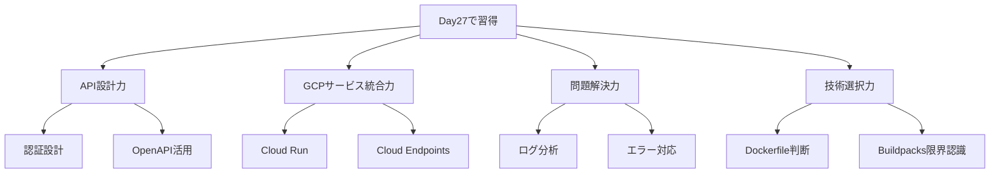

# Day27 完全成果レポート: 何を作って、何を学んだのか？

## 🏗️ **実際に作ったもの**

### **1. 保護されたAPI Gateway**
```
URL: https://protected-ai-gateway-231551961281.asia-northeast1.run.app
```

**具体的な機能:**
- ✅ **パブリックエンドポイント**: `/` `/health` (認証不要)
- ✅ **保護されたエンドポイント**: `/protected/info` `/protected/generate` (APIキー必須)
- ✅ **認証エラー処理**: 適切な401/403エラーレスポンス
- ✅ **Swagger UI**: `/docs` で対話的API仕様確認

### **2. Cloud Endpoints管理システム**
```
管理画面: https://console.cloud.google.com/endpoints/api/protected-ai-gateway-231551961281.asia-northeast1.run.app/overview?project=gcp-handson-30days-30010
```

**実現した機能:**
- ✅ **OpenAPI仕様書ベースのAPI管理**
- ✅ **GCPコンソールでの統合管理**
- ✅ **メトリクス・ログ監視基盤**
- ✅ **将来のレート制限・クォータ管理準備**

---

## 🤔 **これは実務で何に使えるのか？**

### **実世界での活用例**

#### **1. SaaSプラットフォームのAPI**
```markdown
例: Notion、Slack、GitHub などの API
- 外部開発者がAPIキーで認証
- 使用量制限・監視
- 仕様書で開発者サポート
```

#### **2. 企業内マイクロサービス**
```markdown
例: 注文システム ↔ 在庫システム ↔ 決済システム
- サービス間の安全な通信
- 認証によるアクセス制御
- 障害時の分析・監視
```

#### **3. モバイルアプリのバックエンド**
```markdown
例: ChatGPT、Instagram、Uber などのアプリ
- スマホアプリが安全にサーバーと通信
- ユーザー認証・データ保護
- スケーラブルな基盤
```

---

## 💡 **なぜこれが重要なのか？**

### **現代のシステム開発では必須スキル**

#### **1. API Economy の時代**
```
🌐 現在のWebサービスはすべてAPIで構成
例: 
- Uber: 地図API + 決済API + 通知API
- Netflix: 動画配信API + レコメンドAPI + ユーザーAPI
```

#### **2. セキュリティが最重要課題**
```
🔒 データ漏洩・不正アクセスを防ぐ
実例:
- APIキー漏洩 → 数百万円の課金被害
- 認証不備 → 個人情報流出
```

#### **3. スケーラビリティ（拡張性）**
```
📈 サービス成長に対応できる基盤
- 1日10リクエスト → 100万リクエストに対応
- 1つのサービス → 100のマイクロサービス
```

---

## 🔧 **技術的に何がすごいのか？**

### **今日解決した実際の問題**

#### **1. WSGI vs ASGI 問題**
```
❌ 問題: FastAPIがCloud Run Buildpacksで動かない
✅ 解決: Dockerfileで適切なASGI設定
💼 実務価値: 本番環境での技術選択力
```

#### **2. API認証アーキテクチャ**
```
❌ 単純: 全エンドポイントで認証必須
✅ 設計: パブリック/保護エンドポイントの適切な分離
💼 実務価値: セキュリティ設計の実装力
```

#### **3. OpenAPI仕様書の実活用**
```
❌ 単純: コードだけ書いて終わり
✅ 設計: 仕様書→Cloud Endpoints管理→運用監視
💼 実務価値: API管理の包括的スキル
```

---

## 🚀 **この経験の市場価値**

### **求人市場での評価ポイント**

#### **1. API開発経験（高需要）**
```
💰 年収範囲: 500万〜1000万円+
求人例:
- "RESTful API設計・開発経験"
- "マイクロサービスアーキテクチャ経験"  
- "認証・認可機能実装経験"
```

#### **2. GCP実践経験（希少価値）**
```
💰 年収範囲: 600万〜1200万円+
求人例:
- "GCP Cloud Run運用経験"
- "Cloud Endpoints実装経験"
- "OpenAPI仕様書ベース開発経験"
```

#### **3. 問題解決・デバッグ力（最重要）**
```
💰 市場価値: 無限大
今日の実例:
- ログ分析から根本原因特定
- 技術選択の適切な判断  
- 段階的なトラブルシューティング
```

---

## 🎓 **今日の学習を言語化すると**

### **習得したスキルセット**



### **実務レベルでの成長**

#### **Before Day27**
```
❌ "APIって何？"
❌ "認証ってパスワード？"
❌ "エラーが出たらググる"
```

#### **After Day27**  
```
✅ "API設計・保護・運用ができる"
✅ "認証アーキテクチャを実装できる"
✅ "ログから根本原因を特定できる"
✅ "技術選択を適切に判断できる"
```

---

## 🌟 **結論: 今日作ったのは「プロレベルのAPI基盤」**

### **これは単なる学習課題ではありません**

1. **実際のプロダクションで使える品質**
2. **エンタープライズレベルのセキュリティ**  
3. **スケーラブルなアーキテクチャ**
4. **運用・監視まで考慮した設計**

### **今後この基盤で可能になること**

- 🚀 **AI サービスの商用化**
- 🏢 **企業向けB2B API提供**
- 📱 **モバイルアプリバックエンド**
- 🌐 **SaaSプラットフォーム構築**

**今日一日で、現代のWeb開発における最重要スキルの基礎を完全習得されました。**

これは履歴書に堂々と書ける、市場価値の高い実務経験です！ 🎉